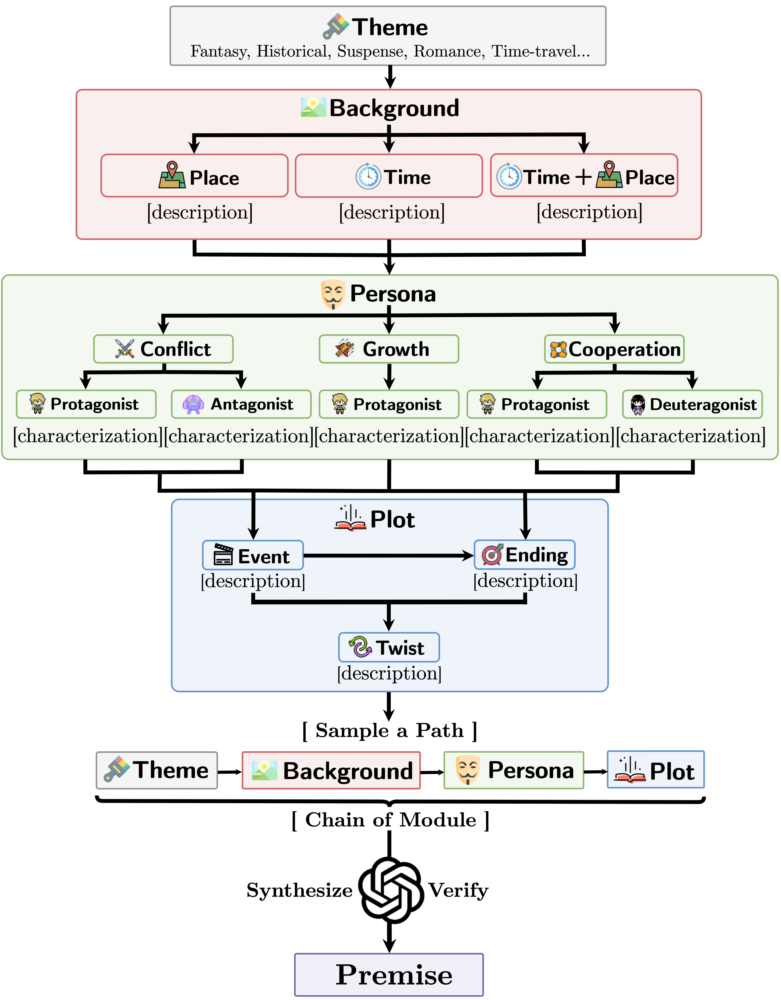

<div align="center">

<div align="center" style="display: flex; align-items: center; justify-content: center;">
    
    <h1> MoPS: Modular Story Premise Synthesis for Open-Ended Automatic Story Generation </h1>
</div>

<h5 align="center"> 
<a href='https://github.com/mantle2048'></a>
<a href='https://huggingface.co/datasets/ManTle/mops'></a>

<p></p>

[Yan Ma](https://mantle2048.github.io/)<sup>1,3,4</sup>,
[Yu Qiao](https://mmlab.siat.ac.cn/yuqiao)<sup>3</sup>,
[Pengfei Liu](http://pfliu.com/)<sup>2,3,4</sup>

<sup>1</sup>Fudan University, <sup>2</sup>Shanghai Jiao Tong University, 

<sup>3</sup>Shanghai AI Laboratory, <sup>4</sup>Generative AI Research Lab (GAIR)

</h5>
</div>

## 👀 Overview

<h4> 

"If a story is going to fail, it will do so first at the premise level." – [Anatomy of a Premise Line](https://www.amazon.com/Anatomy-Premise-Line-Jeff-Lyons/dp/1138838853#:~:text=Anatomy%20of%20a%20Premise%20Line%3A%20How%20to%20Master%20Premise%20and,potentially%20months%20of%20wasted%20writing.)

</h4>

A story premise succinctly defines a story’s main idea, foundation, and trajectory. It serves as the initial trigger in automatic story generation.

<div align=center>

</div>

Existing sources of story premises are limited by a lack of diversity, uneven quality, and high costs that make them difficult to scale. In response, we introduce **Mo**dular Story **P**remise **S**ynthesis (**MoPS**) which breaks down story premises into modules like background and persona for automated design and generation. MoPS consists of three phases: (1) Precollect a consistent set of candidates for each module to form a nested dictionary. (2) Extract a key path from the nested dictionary as the premise design. (3) Instruct an LLM to integrate the design into a coherent premise sentence.

<div align=center>

</div>

## 👨‍💻 Getting started

### Installation

```bash
git clone https://github.com/GAIR-NLP/MoPS
pip install -r requirements.txt
poetry install
```

We use OpenAI model as the language backend and manage environment variables in `.env` via [python-dotenv](https://github.com/theskumar/python-dotenv).

> [!Warning]
> After setting up, please add `.env` to `.gitignore` to prevent uploading sensitive information.
```bash
#!/usr/bin/env bash

OPENAI_API_KEY="your openai api key"

OPENAI_API_BASE="your openai api url"

OPENAI_MODEL="gpt-3.5-turbo-1106"
```

### Resources

#### 1. Modules
> Module candidates in our paper: `./assets/modules`

#### 2. Premises
> Mops & 5 baselines premises and corresponding evaluation in our paper: `./assets/premises`

#### 3. Premised-based Stories
> Mops & 5 baselines stories extended from premises and the corresponding evaluation in our paper: `./assets/stories`

> Stories come in two genres: scripts and novels.

> Scripts are generated using [Dramatron](https://github.com/google-deepmind/dramatron), and novels are generated using [RecurrentGPT](https://github.com/aiwaves-cn/RecurrentGPT).

#### 4. Huggingface dataset
> We created a huggingface dataset including three versions of the MoPS dataset: `complete`, `moderate`, and `curated`, with each entry containing a premise and the extented stories.

> Download on [Huggingface](https://huggingface.co/datasets/ManTle/mops)

## 🎯 Usage

### Stage 1: Induce Module Candidates
```bash
>>> python mops/induce.py --help
usage: induce.py [-h] [OPTIONS]
╭─ options ───────────────────────────────────────────────╮
│ -h, --help              show this help message and exit │
│ --module-dir PATH       (required)                      │
│ --step STR              (required)                      │
│ --max-backgrounds-per-theme INT                         │
│                         (default: 30)                   │
│ --max-personas-per-background INT                       │
│                         (default: 9)                    │
│ --max-events-per-persona INT                            │
│                         (default: 2)                    │
│ --max-endings-per-event INT                             │
│                         (default: 1)                    │
│ --max-twists-per-ending INT                             │
│                         (default: 1)                    │
╰─────────────────────────────────────────────────────────╯
```

#### Step 0: Pre-collect a few themes in `module_dir/theme.json`.

See examples: `./data/modules/theme.json` where `module_dir=./data/modules`


#### Step 1: Induce background
```bash
python mops/induce.py --module-dir ./data/modules --step background --max-backgrounds-per-theme 1
```

#### Step 2: Induce persona
```bash
python mops/induce.py --module-dir ./data/modules --step persona --max-personas-per-background 1
```

#### Step 3: Induce event
```bash
python mops/induce.py --module-dir ./data/modules --step event --max-endings-per-event 1
```

#### Step 4: Induce ending
```bash
python mops/induce.py --module-dir ./data/modules --step ending --max-endings-per-event 1
```

#### Step 5: Induce twist
```bash
python mops/induce.py --module-dir ./data/modules --step twist --max-twists-per-ending 1
```

### Stage 2: Synthesize Premises
```bash
>>> python mops/synthesize.py --help
usage: synthesize.py [-h] [OPTIONS]

╭─ options ──────────────────────────────────────────────────────────────╮
│ -h, --help              show this help message and exit                │
│ --module-dir PATH       (required)                                     │
│ --premise-dir PATH      (required)                                     │
│ --enable-verify, --no-enable-verify                                    │
│                         (default: False)                               │
│ --masks {None}|{[{theme,background,persona,event,ending,twist} [...]]} │
│                         (default: None)                                │
╰────────────────────────────────────────────────────────────────────────╯
```

For example, you can run the following command after stage 1:

```bash
python mops/synthesize.py --module_dir ./data/modules --premise_dir ./data
```

You can flexibly control the required modules through `masks` flag , and the candidates for corresponding modules in the masks will be set as empty strings.

For example, if you want to remove `ending` and `twist` during synthesis, you can run the following:

```bash
python mops/synthesize.py --module_dir ./data/modules --premise_dir ./data --masks ending twist
```

### Stage 3: Evaluate Premises

We use the semantic **Breadth** and **Density** metrics proposed in the paper to evaluate diversity, and evaluate quality based on LLM in the three dimensions of **Fascination**, **Completeness**, and **Originality**.

Please refer to files in [notebooks](https://github.com/GAIR-NLP/MoPS/tree/master/notebooks) for the implementation details of evaluation.

### Stage 4 [Optional]: Use your favorite premise-based automatic story generation pipeline to create long stories

We use [Dramatron](https://github.com/google-deepmind/dramatron) and [RecurrentGPT](https://github.com/aiwaves-cn/RecurrentGPT) in our paper.

If you are looking for more story generation work, we recommend you refer to [Awesome-Story-Generation](https://github.com/yingpengma/Awesome-Story-Generation)
